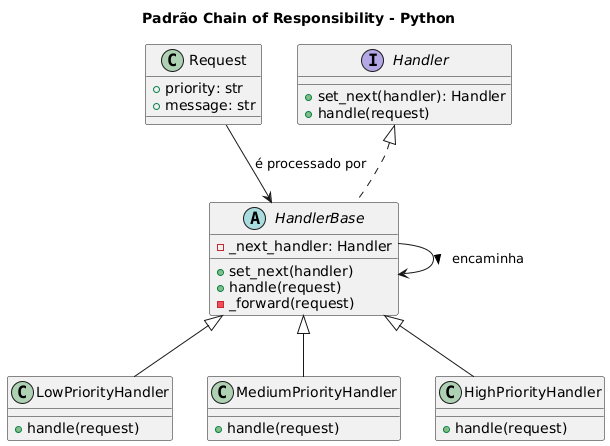

# Sistema de Processamento por Prioridade - Padrão Chain of Responsibility

## Contexto do exemplo:
Imagine um sistema que processa requisições contendo níveis de prioridade.<br>Cada “handler” tenta resolver a requisição:
- Se puder → resolve.
- Se não puder → encaminha para o próximo da cadeia.
Este exemplo cria três handlers:
1. **LowPriorityHandler** — resolve apenas prioridade baixa
2. **MediumPriorityHandler** — resolve apenas média
3. **HighPriorityHandler** — resolve apenas alta

## Sobre o Padrão Chain of Responsibility

O padrão Chain of Responsibility permite passar requisições ao longo de uma cadeia de manipuladores. Cada manipulador decide se processa a requisição ou a passa para o próximo manipulador da cadeia.

## Estrutura do Sistema

### `Request` (Objeto da Requisição)
Representa uma requisição com:
- `priority`: Nível de prioridade ("baixa", "media", "alta")
- `message`: Descrição da requisição

### `Handler` (Interface Base)
Classe abstrata que define o comportamento comum:
- `set_next(handler)`: Define o próximo manipulador na cadeia
- `handle(request)`: Método abstrato para processar requisições
- `_forward(request)`: Encaminha para o próximo manipulador

### Manipuladores Concretos

#### `LowPriorityHandler`
- Processa apenas requisições de prioridade "baixa"
- Encaminha outras prioridades para o próximo manipulador

#### `MediumPriorityHandler`
- Processa apenas requisições de prioridade "media"
- Encaminha outras prioridades para o próximo manipulador

#### `HighPriorityHandler`
- Processa apenas requisições de prioridade "alta"
- Encaminha outras prioridades para o próximo manipulador

## Como Funciona

1. **Construção da cadeia**: Manipuladores são conectados em sequência
2. **Processamento**: Cada manipulador verifica se pode processar a requisição
3. **Encaminhamento**: Se não pode processar, passa para o próximo
4. **Fim da cadeia**: Se nenhum manipulador processa, exibe mensagem de erro

## Código

```python
"""
Exemplo do padrão Chain of Responsibility 
"""

from abc import ABC, abstractmethod


# ----------------------------
# Objeto da requisição
# ----------------------------

class Request:
    """
    Representa uma requisição genérica com um nível de prioridade.
    """
    def __init__(self, priority: str, message: str):
        self.priority = priority
        self.message = message


# ----------------------------
# Interface Base do Handler
# ----------------------------

class Handler(ABC):
    """
    Interface comum para todos os manipuladores.
    Cada Handler deve:
    - Tentar processar a requisição
    - Encaminhar para o próximo handler caso não consiga
    """

    def __init__(self):
        self._next_handler = None

    def set_next(self, handler: "Handler") -> "Handler":
        """
        Define o próximo handler da cadeia.
        O retorno permite encadeamento fluente:
        ex: h1.set_next(h2).set_next(h3)
        """
        self._next_handler = handler
        return handler

    @abstractmethod
    def handle(self, request: Request) -> None:
        """
        Método que tenta processar a requisição.
        Subclasses devem implementar a lógica específica.
        """
        pass

    def _forward(self, request: Request) -> None:
        """
        Encaminha a requisição para o próximo handler, caso exista.
        """
        if self._next_handler:
            self._next_handler.handle(request)
        else:
            print(f"[Sem Handler] Nenhum manipulador conseguiu processar: {request.message}")


# ----------------------------
# Handlers Concretos
# ----------------------------

class LowPriorityHandler(Handler):
    """Processa somente requisições de prioridade 'baixa'."""

    def handle(self, request: Request) -> None:
        if request.priority == "baixa":
            print(f"[LowPriorityHandler] Processando: {request.message}")
        else:
            self._forward(request)


class MediumPriorityHandler(Handler):
    """Processa somente requisições de prioridade 'média'."""

    def handle(self, request: Request) -> None:
        if request.priority == "media":
            print(f"[MediumPriorityHandler] Processando: {request.message}")
        else:
            self._forward(request)


class HighPriorityHandler(Handler):
    """Processa somente requisições de prioridade 'alta'."""

    def handle(self, request: Request) -> None:
        if request.priority == "alta":
            print(f"[HighPriorityHandler] Processando: {request.message}")
        else:
            self._forward(request)


# ----------------------------
# Demonstração de Uso
# ----------------------------

if __name__ == "__main__":
    # Construção da cadeia
    low = LowPriorityHandler()
    medium = MediumPriorityHandler()
    high = HighPriorityHandler()

    # Encadeamento: low -> medium -> high
    low.set_next(medium).set_next(high)

    # Testes
    low.handle(Request("baixa", "Gerar relatório simples"))
    low.handle(Request("media", "Exportar dados para CSV"))
    low.handle(Request("alta", "Enviar alerta urgente"))
    low.handle(Request("critica", "Evento desconhecido"))

```

## Execução

```bash
python exemplo_prioridade.py
```

**Saída esperada:**
```
[LowPriorityHandler] Processando: Gerar relatório simples
[MediumPriorityHandler] Processando: Exportar dados para CSV
[HighPriorityHandler] Processando: Enviar alerta urgente
[Sem Handler] Nenhum manipulador conseguiu processar: Evento desconhecido
```

## Fluxo de Processamento

### Requisição "baixa"
1. `LowPriorityHandler` → **Processa** ✅
2. Não passa adiante

### Requisição "media"
1. `LowPriorityHandler` → Não processa, encaminha
2. `MediumPriorityHandler` → **Processa** ✅

### Requisição "alta"
1. `LowPriorityHandler` → Não processa, encaminha
2. `MediumPriorityHandler` → Não processa, encaminha
3. `HighPriorityHandler` → **Processa** ✅

### Requisição "critica"
1. `LowPriorityHandler` → Não processa, encaminha
2. `MediumPriorityHandler` → Não processa, encaminha
3. `HighPriorityHandler` → Não processa, encaminha
4. **Fim da cadeia** → Mensagem de erro

## Vantagens do Padrão

- **Desacoplamento**: Remetente não precisa conhecer o receptor
- **Flexibilidade**: Fácil adição/remoção de manipuladores
- **Responsabilidade única**: Cada manipulador tem uma função específica
- **Configuração dinâmica**: Cadeia pode ser montada em tempo de execução

## Casos de Uso Práticos

- **Sistemas de suporte**: Escalação por nível de complexidade
- **Processamento de logs**: Diferentes níveis de severidade
- **Validação de dados**: Múltiplas regras de validação
- **Autenticação**: Diferentes métodos de autenticação
- **Middleware**: Processamento de requisições HTTP

## Boas Práticas Implementadas

- **Métodos curtos**: Cada método tem responsabilidade única
- **Nomes descritivos**: Classes e métodos com nomes claros
- **Encadeamento fluente**: `set_next()` retorna o handler para encadeamento
- **Tratamento de fim de cadeia**: Mensagem quando nenhum handler processa
- **Baixo acoplamento**: Handlers não conhecem uns aos outros diretamente

## Extensibilidade

Para adicionar novos tipos de prioridade:

```python
class CriticalPriorityHandler(Handler):
    def handle(self, request: Request) -> None:
        if request.priority == "critica":
            print(f"[CriticalPriorityHandler] Processando: {request.message}")
        else:
            self._forward(request)

# Adicionar à cadeia
low.set_next(medium).set_next(high).set_next(critical)
```