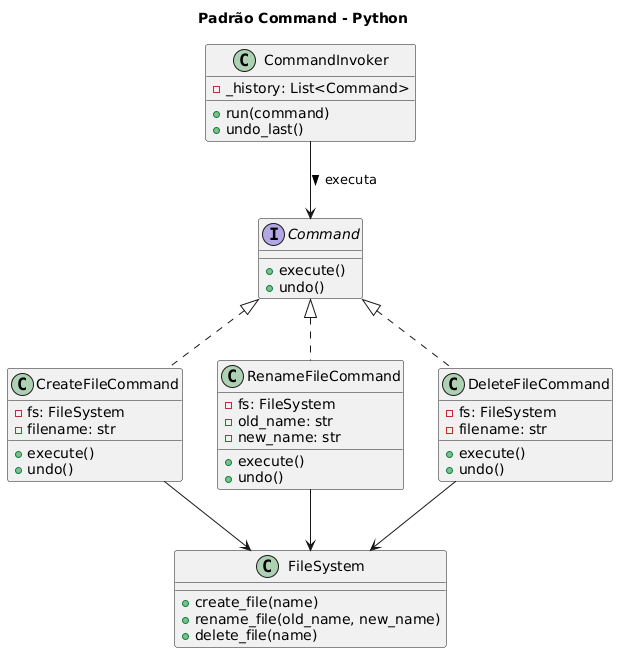

# Sistema de Comandos com Undo - Padrão Command

## ✔ Contexto

Imagine um sistema que executa comandos como:
- Criar arquivo
- Renomear arquivo
- Excluir arquivo

Cada operação é encapsulada em um objeto **Command**, permitindo:
- Histórico de ações
- Desfazer operações (undo)
- Filas e agendamento de comandos
- Invocadores independentes da lógica concreta

## Sobre o Padrão Command

O padrão Command encapsula uma requisição como um objeto, permitindo parametrizar clientes com diferentes requisições, enfileirar operações, registrar logs e suportar operações de desfazer.

## Estrutura do Sistema

### `FileSystem` (Receiver)
Executa as operações reais no sistema de arquivos:
- `create_file(name)`: Cria um arquivo
- `rename_file(old_name, new_name)`: Renomeia um arquivo
- `delete_file(name)`: Exclui um arquivo

### `Command` (Interface Base)
Define o contrato para todos os comandos:
- `execute()`: Executa a operação
- `undo()`: Desfaz a operação

### Comandos Concretos

#### `CreateFileCommand`
- **Execute**: Cria um arquivo
- **Undo**: Exclui o arquivo criado

#### `RenameFileCommand`
- **Execute**: Renomeia arquivo (old_name → new_name)
- **Undo**: Renomeia de volta (new_name → old_name)

#### `DeleteFileCommand`
- **Execute**: Exclui um arquivo
- **Undo**: Recria o arquivo excluído

### `CommandInvoker` (Invoker)
Gerencia a execução e histórico dos comandos:
- `run(command)`: Executa comando e adiciona ao histórico
- `undo_last()`: Desfaz o último comando executado

## Como Funciona

1. **Encapsulamento**: Cada operação é encapsulada em um objeto Command
2. **Execução**: Invoker executa o comando e armazena no histórico
3. **Undo**: Invoker pode desfazer comandos na ordem inversa
4. **Desacoplamento**: Cliente não precisa conhecer o Receiver diretamente

## Código

```python
"""
Exemplo do padrão Command em Python
"""

from abc import ABC, abstractmethod


# ============================================
# Receiver — executa ações reais
# ============================================

class FileSystem:
    """
    Simula operações de um sistema de arquivos.
    É o 'Receiver' do padrão Command.
    """

    def create_file(self, name: str) -> None:
        print(f"[FileSystem] Arquivo criado: {name}")

    def rename_file(self, old_name: str, new_name: str) -> None:
        print(f"[FileSystem] Arquivo renomeado: {old_name} → {new_name}")

    def delete_file(self, name: str) -> None:
        print(f"[FileSystem] Arquivo deletado: {name}")


# ============================================
# Command — Interface base
# ============================================

class Command(ABC):
    """
    Define o contrato que todos os comandos devem cumprir.
    """

    @abstractmethod
    def execute(self) -> None:
        """Executa o comando."""
        pass

    @abstractmethod
    def undo(self) -> None:
        """Desfaz o comando (quando aplicável)."""
        pass


# ============================================
# Commands Concretos
# ============================================

class CreateFileCommand(Command):
    """
    Command para criar um arquivo.
    """

    def __init__(self, fs: FileSystem, filename: str):
        self.fs = fs
        self.filename = filename

    def execute(self) -> None:
        self.fs.create_file(self.filename)

    def undo(self) -> None:
        self.fs.delete_file(self.filename)


class RenameFileCommand(Command):
    """
    Command para renomear um arquivo.
    """

    def __init__(self, fs: FileSystem, old_name: str, new_name: str):
        self.fs = fs
        self.old_name = old_name
        self.new_name = new_name

    def execute(self) -> None:
        self.fs.rename_file(self.old_name, self.new_name)

    def undo(self) -> None:
        self.fs.rename_file(self.new_name, self.old_name)


class DeleteFileCommand(Command):
    """
    Command para excluir um arquivo.
    """

    def __init__(self, fs: FileSystem, filename: str):
        self.fs = fs
        self.filename = filename

    def execute(self) -> None:
        self.fs.delete_file(self.filename)

    def undo(self) -> None:
        self.fs.create_file(self.filename)


# ============================================
# Invoker — solicita a execução
# ============================================

class CommandInvoker:
    """
    Invoker que armazena um histórico de comandos executados.
    Permite desfazer operações.
    """

    def __init__(self):
        self._history = []

    def run(self, command: Command) -> None:
        """
        Executa um comando e registra seu histórico.
        """
        command.execute()
        self._history.append(command)

    def undo_last(self) -> None:
        """
        Desfaz o último comando executado.
        """
        if not self._history:
            print("[Invoker] Nada para desfazer.")
            return

        last_command = self._history.pop()
        last_command.undo()


# ============================================
# Demonstração de Uso
# ============================================

if __name__ == "__main__":
    fs = FileSystem()
    invoker = CommandInvoker()

    # Comandos
    create = CreateFileCommand(fs, "relatorio.txt")
    rename = RenameFileCommand(fs, "relatorio.txt", "relatorio_final.txt")
    delete = DeleteFileCommand(fs, "relatorio_final.txt")

    # Execução
    invoker.run(create)
    invoker.run(rename)
    invoker.run(delete)

    # Undo
    invoker.undo_last()
    invoker.undo_last()
    invoker.undo_last()
    invoker.undo_last()  # nada para desfazer

```

## Execução

```bash
python exemplo_command.py
```

**Saída esperada:**
```
[FileSystem] Arquivo criado: relatorio.txt
[FileSystem] Arquivo renomeado: relatorio.txt → relatorio_final.txt
[FileSystem] Arquivo deletado: relatorio_final.txt
[FileSystem] Arquivo criado: relatorio_final.txt
[FileSystem] Arquivo renomeado: relatorio_final.txt → relatorio.txt
[FileSystem] Arquivo deletado: relatorio.txt
[Invoker] Nada para desfazer.
```

## Fluxo de Execução

### Fase de Execução
1. `CreateFileCommand.execute()` → Cria "relatorio.txt"
2. `RenameFileCommand.execute()` → Renomeia para "relatorio_final.txt"
3. `DeleteFileCommand.execute()` → Exclui "relatorio_final.txt"

### Fase de Undo (ordem inversa)
1. `DeleteFileCommand.undo()` → Recria "relatorio_final.txt"
2. `RenameFileCommand.undo()` → Renomeia de volta para "relatorio.txt"
3. `CreateFileCommand.undo()` → Exclui "relatorio.txt"

## Vantagens do Padrão Command

- **Desacoplamento**: Separa quem invoca de quem executa
- **Undo/Redo**: Facilita implementação de desfazer/refazer
- **Logging**: Permite registrar todas as operações
- **Macro comandos**: Possibilita agrupar comandos
- **Enfileiramento**: Comandos podem ser executados posteriormente

## Casos de Uso Práticos

- **Editores de texto**: Undo/Redo de operações
- **Interfaces gráficas**: Botões e menus
- **Sistemas de transação**: Rollback de operações
- **Automação**: Scripts e macros
- **Jogos**: Sistema de replay e undo
- **APIs**: Enfileiramento de requisições

## Extensões Possíveis

### Macro Command
```python
class MacroCommand(Command):
    def __init__(self, commands: list[Command]):
        self.commands = commands
    
    def execute(self):
        for cmd in self.commands:
            cmd.execute()
    
    def undo(self):
        for cmd in reversed(self.commands):
            cmd.undo()
```

### Command com Parâmetros
```python
class CopyFileCommand(Command):
    def __init__(self, fs: FileSystem, source: str, dest: str):
        self.fs = fs
        self.source = source
        self.dest = dest
    
    def execute(self):
        self.fs.copy_file(self.source, self.dest)
    
    def undo(self):
        self.fs.delete_file(self.dest)
```

## Considerações de Implementação

- **Estado**: Comandos devem armazenar informações necessárias para undo
- **Memória**: Histórico pode consumir muita memória em aplicações longas
- **Complexidade**: Alguns comandos podem ser difíceis de desfazer
- **Atomicidade**: Considere transações para operações complexas