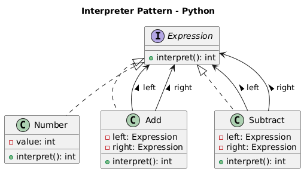

# Padrão Interpreter - Avaliador de Expressões Matemáticas

## ✔ Contexto do exemplo
Vamos criar um interpretador para expressões matemáticas simples:
- Números
- Soma
- Subtração

A expressão será construída como uma árvore, e o método interpret() irá avaliá-la.

## 🧠 Sobre o Padrão Interpreter

O Padrão Interpreter define uma representação para a gramática de uma linguagem e um interpretador que usa essa representação para interpretar sentenças na linguagem.

## 🏗️ Estrutura do Código

### Componentes

- **`Expression`**: Interface base para todas as expressões
- **`Number`**: Expressão terminal (números literais)
- **`Add`**: Expressão não-terminal (operação de soma)
- **`Subtract`**: Expressão não-terminal (operação de subtração)

## ✅ Código
```python
"""
Exemplo do padrão Interpreter em Python com:
- Árvores sintáticas simples
"""

from abc import ABC, abstractmethod


# =======================================================
# Interface da Expressão (Nonterminal / Terminal)
# =======================================================

class Expression(ABC):
    """
    Interface base para todas as expressões da gramática.
    """

    @abstractmethod
    def interpret(self) -> int:
        """
        Avalia a expressão e retorna o resultado inteiro.
        """
        pass


# =======================================================
# Expressões Terminais
# =======================================================

class Number(Expression):
    """
    Representa um número literal na expressão.
    """

    def __init__(self, value: int):
        self.value = value

    def interpret(self) -> int:
        return self.value


# =======================================================
# Expressões Não Terminais (Operadores)
# =======================================================

class Add(Expression):
    """
    Representa uma soma entre duas expressões.
    """

    def __init__(self, left: Expression, right: Expression):
        self.left = left
        self.right = right

    def interpret(self) -> int:
        # Delegação clara: cada lado interpreta a si mesmo.
        return self.left.interpret() + self.right.interpret()


class Subtract(Expression):
    """
    Representa uma subtração entre duas expressões.
    """

    def __init__(self, left: Expression, right: Expression):
        self.left = left
        self.right = right

    def interpret(self) -> int:
        return self.left.interpret() - self.right.interpret()


# =======================================================
# Exemplo de Uso
# =======================================================

if __name__ == "__main__":
    # Expressão: 10 + (5 - 2)
    expression = Add(
        Number(10),
        Subtract(Number(5), Number(2))
    )

    result = expression.interpret()
    print(f"Resultado da expressão: {result}")

```

## 🚀 Como Executar

```bash
python exemplo_interpreter.py
```

## 📋 Exemplo

Avalia a expressão: **10 + (5 - 2)**

```python
expression = Add(
    Number(10),
    Subtract(Number(5), Number(2))
)
result = expression.interpret()  # Resultado: 13
```

## 📊 Saída

```
Resultado da expressão: 13
```

## 💡 Vantagens

- **Extensibilidade**: Fácil adição de novas operações
- **Composição**: Expressões complexas compostas por simples
- **Recursividade**: Avaliação natural em árvore

## 🎯 Casos de Uso

- Calculadoras
- Linguagens de consulta
- Parsers de comandos
- Sistemas de regras