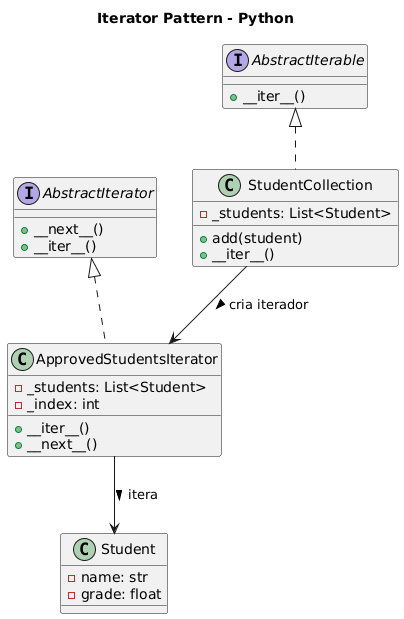

# Padrão Iterator - Coleção de Alunos Aprovados

## ✔ Contexto
Criamos:
- StudentCollection → coleção customizada
- ApprovedStudentsIterator → iterador que retorna apenas alunos com nota ≥ 7
- Student → entidade simples

Isso demonstra como abstrair o mecanismo de iteração sem expor a estrutura interna.

## 🔄 Sobre o Padrão Iterator

O Padrão Iterator fornece uma maneira de acessar sequencialmente os elementos de uma coleção sem expor sua representação interna. Permite diferentes formas de percorrer a mesma estrutura de dados.

## 🏗️ Estrutura do Código

### Componentes

- **`Student`**: Entidade que representa um aluno com nome e nota
- **`AbstractIterator`**: Interface para iteradores customizados
- **`AbstractIterable`**: Interface para coleções iteráveis
- **`ApprovedStudentsIterator`**: Iterador que filtra apenas alunos com nota ≥ 7
- **`StudentCollection`**: Coleção customizada de alunos

## ✅ Código Python
```python
"""
Exemplo do padrão Iterator em Python.
Implementa uma coleção customizada e um iterador específico
seguindo boas práticas de Clean Code.
"""

from abc import ABC, abstractmethod
from typing import List, Iterator


# ==========================================================
# Entidade simples
# ==========================================================

class Student:
    """
    Representa um aluno com nome e nota.
    """
    def __init__(self, name: str, grade: float):
        self.name = name
        self.grade = grade

    def __repr__(self):
        return f"Student(name='{self.name}', grade={self.grade})"


# ==========================================================
# Interfaces formais do padrão Iterator
# ==========================================================

class AbstractIterator(ABC):
    """
    Interface que define o comportamento de um iterador customizado.
    """

    @abstractmethod
    def __next__(self):
        pass

    @abstractmethod
    def __iter__(self):
        pass


class AbstractIterable(ABC):
    """
    Interface que define o comportamento de coleções que podem ser iteradas.
    """

    @abstractmethod
    def __iter__(self) -> Iterator:
        pass


# ==========================================================
# Iterator concreto — percorre apenas alunos aprovados
# ==========================================================

class ApprovedStudentsIterator(AbstractIterator):
    """
    Iterador que retorna somente os alunos com nota >= 7.
    """

    def __init__(self, students: List[Student]):
        self._students = students
        self._index = 0

    def __iter__(self):
        return self

    def __next__(self) -> Student:
        # Percorre até encontrar um aluno aprovado ou terminar a lista
        while self._index < len(self._students):
            student = self._students[self._index]
            self._index += 1

            if student.grade >= 7:
                return student

        # Encerramento do iterador
        raise StopIteration()


# ==========================================================
# Coleção concreta
# ==========================================================

class StudentCollection(AbstractIterable):
    """
    Coleção customizada que sabe criar seu iterador.
    """

    def __init__(self):
        self._students: List[Student] = []

    def add(self, student: Student) -> None:
        self._students.append(student)

    def __iter__(self) -> Iterator[Student]:
        # Retorna o iterador customizado
        return ApprovedStudentsIterator(self._students)


# ==========================================================
# Exemplo de uso
# ==========================================================

if __name__ == "__main__":
    collection = StudentCollection()

    collection.add(Student("Ana", 8.5))
    collection.add(Student("Bruno", 6.0))
    collection.add(Student("Carla", 7.3))
    collection.add(Student("Diego", 4.2))

    print("Alunos aprovados:")
    for student in collection:
        print(student)
```

## 🚀 Como Executar

```bash
python exemplo_iterator.py
```

## 📋 Exemplo de Uso

```python
collection = StudentCollection()

collection.add(Student("Ana", 8.5))     # Aprovada
collection.add(Student("Bruno", 6.0))   # Reprovado
collection.add(Student("Carla", 7.3))   # Aprovada
collection.add(Student("Diego", 4.2))   # Reprovado

# Itera apenas sobre alunos aprovados
for student in collection:
    print(student)
```

## 📊 Saída Esperada

```
Alunos aprovados:
Student(name='Ana', grade=8.5)
Student(name='Carla', grade=7.3)
```

## 💡 Vantagens

- **Encapsulamento**: Esconde a estrutura interna da coleção
- **Flexibilidade**: Diferentes iteradores para diferentes critérios
- **Protocolo Python**: Integra com `for` loops nativamente
- **Filtragem**: Permite iteração condicional sem modificar dados

## 🎯 Casos de Uso

- Filtragem de dados durante iteração
- Diferentes formas de percorrer estruturas
- Lazy evaluation de grandes coleções
- Implementação de algoritmos de busca
- Processamento de dados em lote