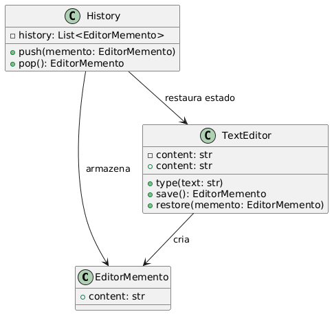

# Padrão Memento

## Visão Geral

O padrão **Memento** é um padrão comportamental que permite capturar e armazenar o estado interno de um objeto sem violar seu encapsulamento, possibilitando restaurar o objeto para um estado anterior posteriormente. É amplamente usado para implementar funcionalidades de "desfazer" (undo).

## Implementação

Este exemplo demonstra um editor de texto simples com funcionalidade de undo usando o padrão Memento.

### Componentes Principais

#### 1. EditorMemento (Memento)
```python
@dataclass(frozen=True)
class EditorMemento:
    content: str
```

Armazena o "instantâneo" do estado interno do editor. O uso de `dataclass(frozen=True)` torna o objeto imutável e seguro contra alterações acidentais.

#### 2. TextEditor (Originator)
```python
class TextEditor:
    def __init__(self) -> None:
        self._content: str = ""
    
    def save(self) -> EditorMemento:
        return EditorMemento(self._content)
    
    def restore(self, memento: EditorMemento) -> None:
        self._content = memento.content
```

Objeto cujo estado deve ser salvo e restaurado. É o único autorizado a criar seus próprios Mementos e acessar seu conteúdo interno.

#### 3. History (Caretaker)
```python
class History:
    def __init__(self) -> None:
        self._history: List[EditorMemento] = []
    
    def push(self, memento: EditorMemento) -> None:
        self._history.append(memento)
    
    def pop(self) -> EditorMemento:
        return self._history.pop()
```

Responsável por armazenar e gerenciar os Mementos. Não altera nem conhece detalhes internos dos Mementos.

## Como Funciona

1. **Criação**: O Originator cria um Memento contendo seu estado atual
2. **Armazenamento**: O Caretaker armazena o Memento sem acessar seu conteúdo
3. **Restauração**: Quando necessário, o Caretaker retorna o Memento ao Originator
4. **Aplicação**: O Originator usa o Memento para restaurar seu estado anterior

## Código

```python
from __future__ import annotations
from dataclasses import dataclass
from typing import List


# =============================================================
# MEMENTO — Armazena o estado interno do objeto originador
# =============================================================
@dataclass(frozen=True)
class EditorMemento:
    """
    Representa o "instantâneo" (snapshot) do estado interno do editor.
    Usar dataclass torna o objeto imutável e seguro contra alterações acidentais.
    """
    content: str


# =============================================================
# ORIGINATOR — Objeto cujo estado deve ser salvo e restaurado
# =============================================================
class TextEditor:
    def __init__(self) -> None:
        self._content: str = ""

    def type(self, new_text: str) -> None:
        """Adiciona texto ao conteúdo atual."""
        self._content += new_text

    def save(self) -> EditorMemento:
        """
        Cria um Memento contendo o estado atual.
        O Originator é o único autorizado a criar seus próprios Mementos.
        """
        return EditorMemento(self._content)

    def restore(self, memento: EditorMemento) -> None:
        """Restaura o conteúdo a partir de um Memento."""
        self._content = memento.content

    @property
    def content(self) -> str:
        """Retorna o conteúdo atual, mantendo encapsulamento."""
        return self._content


# =============================================================
# CARETAKER — Responsável por armazenar e gerenciar Mementos
# =============================================================
class History:
    """
    Armazena os estados anteriores.
    Não altera e nem conhece detalhes internos dos Mementos.
    """
    def __init__(self) -> None:
        self._history: List[EditorMemento] = []

    def push(self, memento: EditorMemento) -> None:
        """Guarda um novo Memento na pilha de histórico."""
        self._history.append(memento)

    def pop(self) -> EditorMemento:
        """Retorna o último Memento salvo (efeito 'undo')."""
        if not self._history:
            raise IndexError("Nenhum estado salvo no histórico.")
        return self._history.pop()


# =============================================================
# Exemplo de uso
# =============================================================
if __name__ == "__main__":
    editor = TextEditor()
    history = History()

    editor.type("Olá")
    history.push(editor.save())  # Salvando estado inicial

    editor.type(", mundo!")
    history.push(editor.save())  # Salvando segundo estado

    print("Antes do undo:", editor.content)

    editor.restore(history.pop())  # Desfaz última ação
    print("Depois de um undo:", editor.content)

    editor.restore(history.pop())  # Desfaz novamente
    print("Depois de dois undo:", editor.content)

```

### Saída Esperada
```
Antes do undo: Olá, mundo!
Depois de um undo: Olá
Depois de dois undo: 
```

## Vantagens

- **Encapsulamento**: Preserva o encapsulamento do objeto originador
- **Simplicidade**: Interface simples para salvar e restaurar estados
- **Flexibilidade**: Permite múltiplos pontos de restauração
- **Segurança**: Mementos imutáveis previnem alterações acidentais

## Desvantagens

- **Memória**: Pode consumir muita memória se usado excessivamente
- **Performance**: Criar snapshots frequentes pode impactar a performance
- **Complexidade**: Pode aumentar a complexidade em sistemas simples

## Casos de Uso

- **Editores de texto**: Funcionalidade undo/redo
- **Jogos**: Sistemas de save/load e checkpoints
- **Transações**: Rollback de operações
- **Configurações**: Backup e restauração de configurações
- **Formulários**: Desfazer alterações em campos

## Estrutura do Padrão


## Variações

- **Memento com múltiplos estados**: Armazenar diferentes aspectos do objeto
- **Memento comprimido**: Usar compressão para economizar memória
- **Memento incremental**: Armazenar apenas as diferenças entre estados

O padrão Memento é essencial quando você precisa implementar funcionalidades de undo/redo mantendo o encapsulamento e a integridade dos dados.