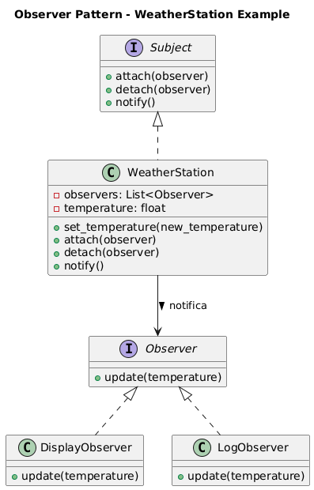

# Padrão Observer (Observador)

## Visão Geral

O padrão **Observer** é um padrão comportamental que define uma dependência um-para-muitos entre objetos, de modo que quando um objeto muda de estado, todos os seus dependentes são notificados e atualizados automaticamente. É também conhecido como padrão Publish-Subscribe.

## Implementação

Este exemplo demonstra uma estação meteorológica que notifica diferentes observadores quando a temperatura muda.

### Componentes Principais

#### 1. Observer (Interface Observer)
```python
class Observer(ABC):
    @abstractmethod
    def update(self, temperature: float) -> None:
        pass
```

Interface que define o contrato para qualquer objeto que deseje ser notificado de mudanças do Subject.

#### 2. Subject (Interface Subject)
```python
class Subject(ABC):
    @abstractmethod
    def attach(self, observer: Observer) -> None:
        pass
    
    @abstractmethod
    def detach(self, observer: Observer) -> None:
        pass
    
    @abstractmethod
    def notify(self) -> None:
        pass
```

Interface que padroniza a relação de inscrição e notificação entre o objeto observado e seus observadores.

#### 3. WeatherStation (Concrete Subject)
```python
class WeatherStation(Subject):
    def __init__(self) -> None:
        self._observers: List[Observer] = []
        self._temperature: float = 0.0
    
    def set_temperature(self, new_temperature: float) -> None:
        self._temperature = new_temperature
        self.notify()
```

Mantém o estado observado (temperatura) e uma lista de observadores interessados nas mudanças.

#### 4. Concrete Observers
```python
class DisplayObserver(Observer):
    def update(self, temperature: float) -> None:
        print(f"[DISPLAY] Temperatura atualizada: {temperature}°C")

class LogObserver(Observer):
    def update(self, temperature: float) -> None:
        print(f"[LOG] Registrando temperatura: {temperature}°C")
```

Implementações específicas que reagem às mudanças de temperatura de formas diferentes.

## Como Funciona

1. **Registro**: Observadores se registram no Subject usando `attach()`
2. **Mudança**: Quando o estado do Subject muda, ele chama `notify()`
3. **Notificação**: O Subject percorre sua lista e chama `update()` em cada Observer
4. **Reação**: Cada Observer executa sua lógica específica de resposta

## Exemplo de Uso

```python
# Criar estação meteorológica
station = WeatherStation()

# Criar observadores
display = DisplayObserver()
logger = LogObserver()

# Registrar observadores
station.attach(display)
station.attach(logger)

# Alterar temperatura (notifica todos)
station.set_temperature(25.3)
station.set_temperature(27.8)

# Remover um observador
station.detach(logger)

# Nova alteração (apenas display é notificado)
station.set_temperature(30.1)
```

### Saída Esperada
```
[DISPLAY] Temperatura atualizada: 25.3°C
[LOG] Registrando temperatura: 25.3°C
[DISPLAY] Temperatura atualizada: 27.8°C
[LOG] Registrando temperatura: 27.8°C
[DISPLAY] Temperatura atualizada: 30.1°C
```

## Vantagens

- **Baixo Acoplamento**: Subject e Observer são fracamente acoplados
- **Comunicação Dinâmica**: Observadores podem ser adicionados/removidos em tempo de execução
- **Princípio Aberto/Fechado**: Novos observadores podem ser criados sem modificar o Subject
- **Broadcast**: Um Subject pode notificar múltiplos observadores simultaneamente

## Desvantagens

- **Performance**: Muitos observadores podem impactar a performance
- **Vazamentos de Memória**: Observadores não removidos podem causar vazamentos
- **Ordem de Notificação**: A ordem das notificações pode ser importante mas não é garantida
- **Debugging**: Pode ser difícil rastrear o fluxo de notificações

## Casos de Uso

- **Interfaces Gráficas**: Atualização de views quando o modelo muda (MVC/MVP)
- **Sistemas de Eventos**: Notificação de eventos do sistema
- **Monitoramento**: Alertas quando métricas excedem limites
- **Cache**: Invalidação quando dados originais mudam
- **Logs**: Registro automático de mudanças de estado

## Código
```python
from __future__ import annotations
from abc import ABC, abstractmethod
from typing import List


# =============================================================
# OBSERVER — Interface dos observadores
# =============================================================
class Observer(ABC):
    """
    Interface que define o contrato para qualquer objeto que deseje
    ser notificado de mudanças do Subject.
    """

    @abstractmethod
    def update(self, temperature: float) -> None:
        """Executa ações quando o estado observado muda."""
        pass


# =============================================================
# SUBJECT — Interface do objeto observado
# =============================================================
class Subject(ABC):
    """
    Interface que padroniza a relação de inscrição e notificação.
    """

    @abstractmethod
    def attach(self, observer: Observer) -> None:
        pass

    @abstractmethod
    def detach(self, observer: Observer) -> None:
        pass

    @abstractmethod
    def notify(self) -> None:
        """Notifica todos os observadores sobre atualizações."""
        pass


# =============================================================
# CONCRETE SUBJECT — Mantém o estado observado
# =============================================================
class WeatherStation(Subject):
    """
    Representa uma estação climática que mantém uma lista de
    observadores e um valor de temperatura.
    """

    def __init__(self) -> None:
        self._observers: List[Observer] = []
        self._temperature: float = 0.0

    def attach(self, observer: Observer) -> None:
        """Registra um observador interessado nas atualizações."""
        self._observers.append(observer)

    def detach(self, observer: Observer) -> None:
        """Remove um observador da lista."""
        self._observers.remove(observer)

    def notify(self) -> None:
        """Notifica todos os observadores."""
        for observer in self._observers:
            observer.update(self._temperature)

    def set_temperature(self, new_temperature: float) -> None:
        """
        Atualiza o estado e dispara notificações.
        A separação em dois métodos evita efeitos colaterais inesperados.
        """
        self._temperature = new_temperature
        self.notify()


# =============================================================
# CONCRETE OBSERVERS — Reagem a atualizações
# =============================================================
class DisplayObserver(Observer):
    """Exibe a temperatura sempre que ela muda."""

    def update(self, temperature: float) -> None:
        print(f"[DISPLAY] Temperatura atualizada: {temperature}°C")


class LogObserver(Observer):
    """Registra temperatura em log sempre que houver mudança."""

    def update(self, temperature: float) -> None:
        print(f"[LOG] Registrando temperatura: {temperature}°C")


# =============================================================
# Exemplo de uso
# =============================================================
if __name__ == "__main__":
    station = WeatherStation()

    display = DisplayObserver()
    logger = LogObserver()

    station.attach(display)
    station.attach(logger)

    station.set_temperature(25.3)
    station.set_temperature(27.8)

    station.detach(logger)

    station.set_temperature(30.1)  # Apenas o display será notificado

```

## Variações

### Observer com Dados Específicos
```python
def update(self, subject: Subject, data: dict) -> None:
    # Observer recebe dados específicos sobre a mudança
```

### Observer com Filtros
```python
class FilteredObserver(Observer):
    def __init__(self, condition):
        self.condition = condition
    
    def update(self, temperature: float) -> None:
        if self.condition(temperature):
            # Só reage se a condição for atendida
```

## Estrutura do Padrão


## Relação com Outros Padrões

- **Mediator**: Observer é mais simples, comunicação direta um-para-muitos
- **Command**: Pode ser usado junto para encapsular notificações
- **Singleton**: Subject frequentemente implementado como Singleton

O padrão Observer é fundamental para criar sistemas reativos e desacoplados, sendo amplamente usado em frameworks de interface gráfica e arquiteturas orientadas a eventos.