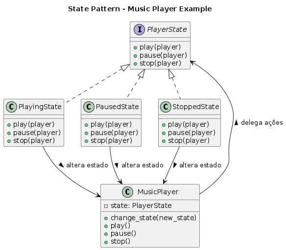

# Padrão State - Player de Música

## O que é o Padrão State?

O padrão **State** permite que um objeto altere seu comportamento quando seu estado interno muda. O objeto parece ter mudado de classe.

## Implementação: Player de Música

Este exemplo simula um player de música com três estados:

### Estados Disponíveis
- **StoppedState**: Música parada
- **PlayingState**: Música tocando
- **PausedState**: Música pausada

### Componentes

**PlayerState (Interface)**
```python
class PlayerState(ABC):
    # Define operações: play(), pause(), stop()
```

**MusicPlayer (Contexto)**
```python
class MusicPlayer:
    # Delega ações para o estado atual
```

**Estados Concretos**
- `PlayingState`: Gerencia quando está tocando
- `PausedState`: Gerencia quando está pausado  
- `StoppedState`: Gerencia quando está parado

## Fluxo de Estados

```
Stopped → play() → Playing
Playing → pause() → Paused
Paused → play() → Playing
Playing → stop() → Stopped
```

## Código

```python
from __future__ import annotations
from abc import ABC, abstractmethod


# =============================================================
# STATE — Interface de comportamento dos estados
# =============================================================
class PlayerState(ABC):
    """
    Interface que define as operações que mudam
    de comportamento conforme o estado atual do Player.
    """

    @abstractmethod
    def play(self, player: MusicPlayer) -> None:
        pass

    @abstractmethod
    def pause(self, player: MusicPlayer) -> None:
        pass

    @abstractmethod
    def stop(self, player: MusicPlayer) -> None:
        pass


# =============================================================
# CONTEXT — Objeto cujo comportamento muda dinamicamente
# =============================================================
class MusicPlayer:
    """
    Representa o tocador de música.
    O estado interno determina o comportamento das ações.
    """

    def __init__(self) -> None:
        self._state: PlayerState = StoppedState()  # Estado inicial

    def change_state(self, new_state: PlayerState) -> None:
        """Altera o estado interno de forma controlada."""
        self._state = new_state

    def play(self) -> None:
        """Delegação da ação ao estado atual."""
        self._state.play(self)

    def pause(self) -> None:
        """Delegação da ação ao estado atual."""
        self._state.pause(self)

    def stop(self) -> None:
        """Delegação da ação ao estado atual."""
        self._state.stop(self)


# =============================================================
# CONCRETE STATES — Implementações específicas
# =============================================================
class PlayingState(PlayerState):
    """Estado no qual o player está reproduzindo música."""

    def play(self, player: MusicPlayer) -> None:
        print("Já está tocando.")

    def pause(self, player: MusicPlayer) -> None:
        print("Música pausada.")
        player.change_state(PausedState())

    def stop(self, player: MusicPlayer) -> None:
        print("Música parada.")
        player.change_state(StoppedState())


class PausedState(PlayerState):
    """Estado no qual o player está pausado."""

    def play(self, player: MusicPlayer) -> None:
        print("Retomando música.")
        player.change_state(PlayingState())

    def pause(self, player: MusicPlayer) -> None:
        print("A música já está pausada.")

    def stop(self, player: MusicPlayer) -> None:
        print("Parando música.")
        player.change_state(StoppedState())


class StoppedState(PlayerState):
    """Estado no qual o player está parado."""

    def play(self, player: MusicPlayer) -> None:
        print("Iniciando reprodução.")
        player.change_state(PlayingState())

    def pause(self, player: MusicPlayer) -> None:
        print("Não é possível pausar — música já está parada.")

    def stop(self, player: MusicPlayer) -> None:
        print("A música já está parada.")


# =============================================================
# Exemplo de uso
# =============================================================
if __name__ == "__main__":
    player = MusicPlayer()

    player.play()   # Stopped -> Playing
    player.pause()  # Playing -> Paused
    player.play()   # Paused -> Playing
    player.stop()   # Playing -> Stopped

```

## Como Executar

```python
python exemplo_state.py
```

## Vantagens

- Elimina condicionais complexas
- Cada estado é uma classe separada
- Fácil de adicionar novos estados
- Comportamento específico por estado

## Quando Usar

- Objetos com comportamentos que mudam por estado
- Máquinas de estado
- Muitas condicionais baseadas em estado