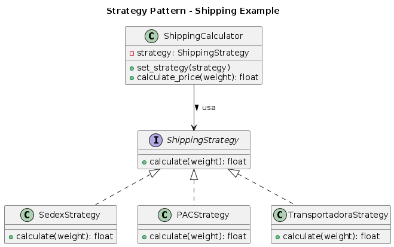

# Padrão Strategy - Calculadora de Frete

## O que é o Padrão Strategy?

O padrão **Strategy** define uma família de algoritmos, encapsula cada um e os torna intercambiáveis. Permite que o algoritmo varie independentemente dos clientes que o usam.

## Implementação: Calculadora de Frete

Este exemplo demonstra diferentes estratégias para calcular frete de envio.

### Estratégias Disponíveis
- **SedexStrategy**: Frete rápido (R$ 20,00 + R$ 5,00/kg)
- **PACStrategy**: Frete econômico (R$ 10,00 + R$ 2,00/kg)
- **TransportadoraStrategy**: Frete com seguro (R$ 30,00 + R$ 3,00/kg)

### Componentes

**ShippingStrategy (Interface)**
```python
class ShippingStrategy(ABC):
    # Define método calculate(weight)
```

**ShippingCalculator (Contexto)**
```python
class ShippingCalculator:
    # Usa uma estratégia para calcular frete
```

**Estratégias Concretas**
- `SedexStrategy`: Cálculo para Sedex
- `PACStrategy`: Cálculo para PAC
- `TransportadoraStrategy`: Cálculo para transportadora

## Como Funciona

1. O `ShippingCalculator` recebe uma estratégia
2. Delega o cálculo para a estratégia atual
3. Estratégias podem ser trocadas em tempo de execução

## Código

```python
from __future__ import annotations
from abc import ABC, abstractmethod


# =============================================================
# STRATEGY — Interface para algoritmos intercambiáveis
# =============================================================
class ShippingStrategy(ABC):
    """
    Interface que define o algoritmo de cálculo de frete.
    Permite substituir estratégias de forma flexível.
    """

    @abstractmethod
    def calculate(self, weight: float) -> float:
        """Calcula o valor do frete."""
        pass


# =============================================================
# CONCRETE STRATEGIES — Implementações do algoritmo
# =============================================================
class SedexStrategy(ShippingStrategy):
    """Cálculo para o serviço de frete Sedex."""

    def calculate(self, weight: float) -> float:
        # Taxa fixa + taxa variável por quilo
        return 20.0 + (weight * 5.0)


class PACStrategy(ShippingStrategy):
    """Cálculo para o serviço PAC."""

    def calculate(self, weight: float) -> float:
        # Frete mais barato, porém mais lento
        return 10.0 + (weight * 2.0)


class TransportadoraStrategy(ShippingStrategy):
    """Cálculo de empresa transportadora."""

    def calculate(self, weight: float) -> float:
        # Geralmente mais caro, porém com seguro incluso
        return 30.0 + (weight * 3.0)


# =============================================================
# CONTEXT — Usa uma estratégia, mas não depende de detalhes internos
# =============================================================
class ShippingCalculator:
    """
    Contexto que utiliza uma estratégia de cálculo de frete.
    Permite a troca dinâmica da estratégia conforme necessidade.
    """

    def __init__(self, strategy: ShippingStrategy) -> None:
        self._strategy = strategy

    def set_strategy(self, strategy: ShippingStrategy) -> None:
        """Altera a estratégia em tempo de execução."""
        self._strategy = strategy

    def calculate_price(self, weight: float) -> float:
        """
        Delegação para a estratégia.
        O Context não sabe COMO o valor é calculado.
        """
        return self._strategy.calculate(weight)


# =============================================================
# Exemplo de uso
# =============================================================
if __name__ == "__main__":
    calculator = ShippingCalculator(SedexStrategy())

    print("Frete via Sedex:", calculator.calculate_price(5))

    calculator.set_strategy(PACStrategy())
    print("Frete via PAC:", calculator.calculate_price(5))

    calculator.set_strategy(TransportadoraStrategy())
    print("Frete via Transportadora:", calculator.calculate_price(5))

```

## Vantagens

- Algoritmos intercambiáveis em tempo de execução
- Elimina condicionais complexas
- Facilita adição de novas estratégias
- Separa implementação de uso

## Quando Usar

- Múltiplas formas de executar uma tarefa
- Algoritmos que mudam conforme contexto
- Eliminar estruturas condicionais grandes
- Permitir escolha de algoritmo pelo cliente