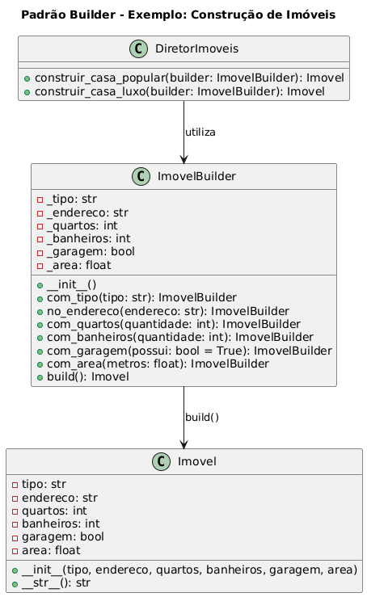

# Padrão Builder - Exemplo de Imóvel

## Visão Geral
O Builder é usado para construir objetos que possuem muitos parâmetros opcionais ou configurações diferentes. Em vez de usar um construtor gigante (conhecido como "telescoping constructor") ou vários métodos setter propensos a erros, o Builder fornece uma interface fluente e passo a passo para configurar o objeto. 

## Cenário
Imagine que você está desenvolvendo um sistema imobiliário onde os usuários podem criar diferentes tipos de imóveis (casas, apartamentos, etc.) com várias características opcionais, como número de quartos, banheiros, área, garagem, etc. O Builder permite que você crie esses imóveis de forma flexível e legível.

## Estrutura do Padrão

### Produto
- `Imovel` - Objeto complexo sendo construído com múltiplos atributos opcionais

### Builder
- `ImovelBuilder` - Constrói o objeto passo a passo usando interface fluente (method chaining)

### Diretor (Opcional)
- `DiretorImoveis` - Define construções padronizadas e presets comuns

## Principais Benefícios

1. **Construção Flexível** - Permite criar objetos com diferentes configurações
2. **Interface Fluente** - Métodos encadeáveis tornam o código mais legível
3. **Reutilização** - Diretor fornece presets para construções comuns
4. **Validação** - Centraliza lógica de construção e validação
5. **Imutabilidade** - Objeto final pode ser imutável após construção

## Exemplo de Uso

### Construção Manual
```python
imovel = (
    ImovelBuilder()
    .com_tipo("Apartamento")
    .no_endereco("Rua das Flores, 231")
    .com_quartos(3)
    .com_banheiros(2)
    .com_garagem()
    .com_area(85)
    .build()
)
```

### Usando Diretor (Presets)
```python
casa_popular = DiretorImoveis.construir_casa_popular(ImovelBuilder())
casa_luxo = DiretorImoveis.construir_casa_luxo(ImovelBuilder())
```

## Saída
```
Imóvel: Apartamento, Endereço: Rua das Flores, 231, 3 quartos, 2 banheiros, Garagem: True, Área: 85m²
Imóvel: Casa, Endereço: Rua padrão, nº 100, 2 quartos, 1 banheiros, Garagem: False, Área: 48m²
```

## Quando Usar
- Quando o objeto tem muitos parâmetros opcionais
- Quando você precisa de diferentes representações do mesmo objeto
- Quando a construção do objeto é complexa e requer validação
- Quando você quer evitar construtores telescópicos (muitos parâmetros)
- Quando você precisa de presets ou configurações padronizadas