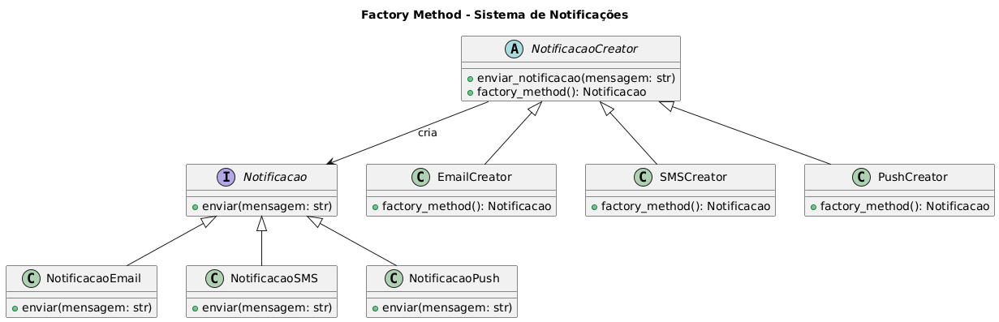

# Padrão Factory Method - Sistema de Notificação

Esta implementação demonstra o padrão de design Factory Method usando um sistema de notificação que pode enviar mensagens através de diferentes canais (Email, SMS, Push).

## Visão Geral do Padrão

O padrão Factory Method fornece uma interface para criar objetos sem especificar suas classes exatas. Ele delega a criação de objetos para subclasses, promovendo baixo acoplamento e extensibilidade.

## Cenário
Imagine um sistema de notificação que precisa enviar mensagens através de diferentes canais, como Email, SMS e notificações Push. Usando o padrão Factory Method, podemos definir uma interface comum para criar objetos de notificação, permitindo que o sistema seja facilmente estendido com novos tipos de notificação no futuro.

## Componentes


### Interface do Produto
- **`Notificacao`**: Classe base abstrata que define a interface comum para todos os tipos de notificação
  - `enviar(mensagem: str)`: Método abstrato que deve ser implementado pelos produtos concretos

### Produtos Concretos
- **`NotificacaoEmail`**: Envia notificações via email
- **`NotificacaoSMS`**: Envia notificações via SMS
- **`NotificacaoPush`**: Envia notificações push

### Criador
- **`NotificacaoCreator`**: Classe criadora abstrata que define o método factory
  - `factory_method()`: Método abstrato para criar objetos de notificação
  - `enviar_notificacao(mensagem: str)`: Método de alto nível que usa o método factory

### Criadores Concretos
- **`EmailCreator`**: Cria instâncias de notificação por email
- **`SMSCreator`**: Cria instâncias de notificação por SMS  
- **`PushCreator`**: Cria instâncias de notificação push

## Código
```python
from abc import ABC, abstractmethod

# ----------------------------------------------------------------------
# Produto: Interface comum para todos os tipos de notificações.
# ----------------------------------------------------------------------
class Notificacao(ABC):
    @abstractmethod
    def enviar(self, mensagem: str) -> None:
        """Envia uma mensagem. Deve ser implementado pelas subclasses."""
        pass


# ----------------------------------------------------------------------
# Produtos Concretos: Cada classe implementa uma forma específica de envio.
# ----------------------------------------------------------------------
class NotificacaoEmail(Notificacao):
    def enviar(self, mensagem: str) -> None:
        print(f"[E-MAIL] Enviando mensagem: {mensagem}")


class NotificacaoSMS(Notificacao):
    def enviar(self, mensagem: str) -> None:
        print(f"[SMS] Enviando mensagem: {mensagem}")


class NotificacaoPush(Notificacao):
    def enviar(self, mensagem: str) -> None:
        print(f"[PUSH] Enviando mensagem: {mensagem}")


# ----------------------------------------------------------------------
# Criador (Creator): Define o Factory Method.
# Importante: o método factory_method devolve o "Produto".
# ----------------------------------------------------------------------
class NotificacaoCreator(ABC):

    @abstractmethod
    def factory_method(self) -> Notificacao:
        """
        Factory Method.
        As subclasses decidirão *qual* produto concreto será criado.
        """
        pass

    def enviar_notificacao(self, mensagem: str) -> None:
        """
        Método de alto nível.
        Ele não sabe qual notificação concreta será criada.
        Depende apenas da interface Notificacao.
        """
        notificacao = self.factory_method()
        notificacao.enviar(mensagem)


# ----------------------------------------------------------------------
# Criadores Concretos: Cada um instancia um tipo específico de produto.
# ----------------------------------------------------------------------
class EmailCreator(NotificacaoCreator):
    def factory_method(self) -> Notificacao:
        return NotificacaoEmail()


class SMSCreator(NotificacaoCreator):
    def factory_method(self) -> Notificacao:
        return NotificacaoSMS()


class PushCreator(NotificacaoCreator):
    def factory_method(self) -> Notificacao:
        return NotificacaoPush()


# ----------------------------------------------------------------------
# Uso prático: o código cliente depende apenas dos Creators,
# e não das implementações concretas de notificação.
# Isso reduz acoplamento e aumenta extensibilidade.
# ----------------------------------------------------------------------
if __name__ == "__main__":

    # Cada criador sabe instanciar o tipo correto
    email = EmailCreator()
    sms = SMSCreator()
    push = PushCreator()

    # O método enviar_notificacao funciona igual para todos
    email.enviar_notificacao("Sua matrícula foi confirmada.")
    sms.enviar_notificacao("Código de verificação: 8421.")
    push.enviar_notificacao("Nova atualização disponível!")

```

## Benefícios

- **Extensibilidade**: Fácil de adicionar novos tipos de notificação sem modificar o código existente
- **Baixo Acoplamento**: O código cliente depende apenas de abstrações, não de implementações concretas
- **Responsabilidade Única**: Cada criador é responsável por criar um tipo de notificação
- **Princípio Aberto/Fechado**: Aberto para extensão (novos tipos de notificação) mas fechado para modificação


## Executando o Código

```bash
python notification.py
```

Saída esperada:
```
[E-MAIL] Enviando mensagem: Sua matrícula foi confirmada.
[SMS] Enviando mensagem: Código de verificação: 8421.
[PUSH] Enviando mensagem: Nova atualização disponível!
```