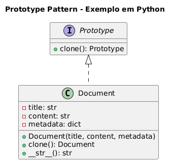

# Padrão Prototype - Exemplo de Documento

## Visão Geral
O padrão Prototype delega o processo de criação de cópias para o próprio objeto a ser clonado, utilizando uma interface comum (geralmente um método clone()). Isso significa que o código do cliente não precisa conhecer as classes concretas dos objetos que está copiando, apenas a interface de clonagem.

## Cenário
Imagine um sistema que gera documentos personalizados, como notas fiscais, relatórios e contratos. Cada documento tem uma estrutura básica, mas pode variar em conteúdo e metadados. Criar cada documento do zero pode ser custoso em termos de tempo e recursos, especialmente se a criação envolver configurações complexas.
## Estrutura do Padrão


### Interface Prototype
- `Prototype` - Interface base que define o método `clone()`

### Prototype Concreto
- `Document` - Classe que implementa a clonagem e representa um documento personalizável

## Principais Benefícios

1. **Performance** - Evita o custo de criação de objetos complexos do zero
2. **Flexibilidade** - Permite criar variações de objetos existentes
3. **Simplicidade** - Reduz a necessidade de subclasses para variações
4. **Configuração Dinâmica** - Objetos podem ser configurados em tempo de execução

## Implementação

### Clonagem Profunda
O exemplo usa `copy.deepcopy()` para garantir que estruturas mutáveis (como dicionários) sejam clonadas corretamente:

```python
def clone(self):
    return copy.deepcopy(self)
```

### Código
```python
import copy

class Prototype:
    """
    Interface base com o método de clonagem.
    Garante que todas as classes concretas implementem clone().
    """
    def clone(self):
        raise NotImplementedError("A subclasse deve implementar clone().")


class Document(Prototype):
    """
    Classe concreta que possui atributos que podem ser clonados.
    Representa um documento personalizável.
    """

    def __init__(self, title, content, metadata):
        # Atributos principais do documento.
        self.title = title
        self.content = content
        
        # Metadados: dicionário com informações adicionais.
        # Deve ser clonado profundamente.
        self.metadata = metadata  

    def clone(self):
        """
        Cria uma cópia profunda do objeto.
        Deep copy é essencial quando há estruturas mutáveis (listas, dicts etc.).
        """
        return copy.deepcopy(self)

    def __str__(self):
        """Retorna uma representação amigável para inspeção."""
        return f"Document(title={self.title}, content={self.content}, metadata={self.metadata})"


# ------------ USO PRÁTICO ------------ #

# Documento base que servirá como protótipo.
prototype_doc = Document(
    title="Template Básico",
    content="Conteúdo padrão do documento.",
    metadata={"author": "Sistema", "version": 1}
)

# Produzindo novos documentos por clonagem.
invoice = prototype_doc.clone()
invoice.title = "Nota Fiscal"
invoice.metadata["document_type"] = "NFe"

report = prototype_doc.clone()
report.title = "Relatório Financeiro"
report.metadata["document_type"] = "Report"

# Visualização
print(invoice)
print(report)

```
## Executando o Código

```bash
python exemplo_documento.py
```
## Saída
```
Document(title=Nota Fiscal, content=Conteúdo padrão do documento., metadata={'author': 'Sistema', 'version': 1, 'document_type': 'NFe'})
Document(title=Relatório Financeiro, content=Conteúdo padrão do documento., metadata={'author': 'Sistema', 'version': 1, 'document_type': 'Report'})
```

## Quando Usar
- Quando a criação de objetos é custosa (conexões de rede, cálculos complexos)
- Quando você precisa de muitos objetos similares com pequenas diferenças
- Quando você quer evitar a criação de muitas subclasses
- Quando objetos precisam ser configurados dinamicamente
- Quando você tem um conjunto de objetos pré-configurados como templates