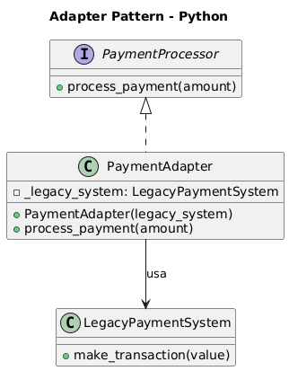

# Padrão Adapter - Exemplo de Processamento de Pagamentos

## Visão Geral
O padrão de projeto Adapter (Adaptador) é um padrão estrutural que permite a colaboração entre objetos com interfaces incompatíveis. Ele atua como uma camada intermediária que converte a interface de uma classe existente em outra interface que o cliente espera, sem modificar o código original das classes envolvidas.

## Cenário
Imagine que você tem um sistema antigo de processamento de pagamentos que não pode ser modificado, mas você deseja integrá-lo a um novo sistema que utiliza uma interface diferente. O Adapter atua como um intermediário, convertendo chamadas da nova interface para a antiga.

## Estrutura do Padrão

### Interface Alvo
- `PaymentProcessor` - Interface moderna que define o contrato esperado pelo sistema atual

### Classe Adaptada (Legacy)
- `LegacyPaymentSystem` - Sistema antigo com interface incompatível que não pode ser modificado

### Adapter
- `PaymentAdapter` - Converte a interface moderna para a interface legada

## Principais Benefícios

1. **Reutilização de Código** - Permite usar sistemas legados sem reescrevê-los
2. **Compatibilidade** - Integra interfaces incompatíveis de forma transparente
3. **Separação de Responsabilidades** - Mantém a lógica de adaptação isolada
4. **Flexibilidade** - Facilita a migração gradual de sistemas

## Implementação

### Interface Moderna
```python
class PaymentProcessor(ABC):
    @abstractmethod
    def process_payment(self, amount: float) -> None:
        pass
```

### Sistema Legado
```python
class LegacyPaymentSystem:
    def make_transaction(self, value: float) -> None:
        print(f"[LEGADO] Pagamento realizado no valor de R$ {value:.2f}")
```

### Adapter
```python
class PaymentAdapter(PaymentProcessor):
    def __init__(self, legacy_system: LegacyPaymentSystem) -> None:
        self._legacy_system = legacy_system

    def process_payment(self, amount: float) -> None:
        # Adiciona taxa de 1% e chama o sistema legado
        amount += amount * 0.01
        self._legacy_system.make_transaction(amount)
```

## Código
```python
from abc import ABC, abstractmethod

# -------------------------------
# Interface esperada pelo sistema
# -------------------------------

class PaymentProcessor(ABC):
    """
    Interface formal que define o contrato para qualquer processador de pagamentos.
    A utilização de ABC contribui para a segurança do design e evita implementações incompletas.
    """

    @abstractmethod
    def process_payment(self, amount: float) -> None:
        """
        Processa um pagamento no valor especificado.
        As subclasses devem implementar este método obrigatoriamente.
        """
        pass


# -------------------------------
# Código legado (não pode ser alterado)
# -------------------------------

class LegacyPaymentSystem:
    """
    Classe de um sistema antigo cuja interface é incompatível com a atual.
    O método make_transaction() possui assinatura diferente.
    """

    def make_transaction(self, value: float) -> None:
        print(f"[LEGADO] Pagamento realizado no valor de R$ {value:.2f}")


# -------------------------------
# Adapter
# -------------------------------

class PaymentAdapter(PaymentProcessor):
    """
    Adapter que converte a interface moderna (process_payment)
    para a interface antiga (make_transaction).
    """

    def __init__(self, legacy_system: LegacyPaymentSystem) -> None:
        self._legacy_system = legacy_system

    def process_payment(self, amount: float) -> None:
        """
        Implementação do método da interface moderna.
        Aqui ocorre a chamada adaptada ao sistema legado.
        """
        self._legacy_system.make_transaction(amount)


# -------------------------------
# Uso prático do Adapter
# -------------------------------

legacy = LegacyPaymentSystem()
processor = PaymentAdapter(legacy)
processor.process_payment(150.00)

```
## Executando o Código

```bash
python exemplo_process_payment.py
```
## Saída
```
[LEGADO] Pagamento realizado no valor de R$ 150.00
```

## Quando Usar
- Quando você precisa usar uma classe existente com interface incompatível
- Quando você quer integrar bibliotecas de terceiros com seu sistema
- Quando você precisa fazer sistemas legados funcionarem com código novo
- Quando você quer criar uma camada de abstração sobre APIs externas
- Durante migrações graduais de sistemas antigos