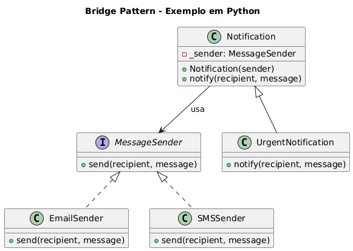

# Padrão Bridge - Sistema de Notificações

## O que é o Padrão Bridge?

O padrão de projeto Bridge (Ponte) é um padrão estrutural que tem como objetivo desacoplar uma abstração da sua implementação, permitindo que ambas possam variar (evoluir) independentemente.

Ele divide uma classe grande ou um conjunto de classes intimamente relacionadas em duas hierarquias separadas: a abstração e a implementação. Ambas as hierarquias podem ser desenvolvidas de forma independente, sem que uma afete a outra.

## Cenário
Um sistema precisa gerar notificações.
A abstração é “Notificação”, mas a implementação pode ser via E-mail, SMS, Push, etc.<br>
O Bridge permite trocar implementações sem alterar a abstração.

## Estrutura do Código

### 1. Implementor (MessageSender)
```python
class MessageSender(ABC):
```
Interface abstrata que define o contrato para todas as implementações de envio de mensagem.

### 2. Implementações Concretas
- **EmailSender**: Envia mensagens via e-mail
- **SMSSender**: Envia mensagens via SMS

### 3. Abstração (Notification)
```python
class Notification:
```
Classe principal que utiliza uma implementação de `MessageSender` através de composição.

### 4. Abstração Refinada (UrgentNotification)
```python
class UrgentNotification(Notification):
```
Extensão da abstração base que adiciona comportamento específico (marca mensagens como urgentes).

## Código Completo

```python
from abc import ABC, abstractmethod

# ---------------------------------------
# Implementor: Define a interface da parte "implementação"
# ---------------------------------------

class MessageSender(ABC):
    """
    Define a interface que todas as implementações de envio de mensagem devem seguir.
    Este é o 'Implementor' no padrão Bridge.
    """

    @abstractmethod
    def send(self, recipient: str, message: str) -> None:
        """Envia a mensagem para o destinatário."""
        pass


# ---------------------------------------
# Concrete Implementors
# ---------------------------------------

class EmailSender(MessageSender):
    """Implementação concreta para envio de mensagens via E-mail."""

    def send(self, recipient: str, message: str) -> None:
        print(f"[Email] Para: {recipient} | Mensagem: {message}")


class SMSSender(MessageSender):
    """Implementação concreta para envio de mensagens via SMS."""

    def send(self, recipient: str, message: str) -> None:
        print(f"[SMS] Para: {recipient} | Mensagem: {message}")


# ---------------------------------------
# Abstraction: Interface principal usada pelo cliente
# ---------------------------------------

class Notification:
    """
    Abstração que utiliza a implementação (MessageSender).
    Permite trocar implementações de envio sem alterar a lógica da notificação.
    """

    def __init__(self, sender: MessageSender) -> None:
        # Composição: a abstração *contém* uma referência para a implementação.
        self._sender = sender

    def notify(self, recipient: str, message: str) -> None:
        """Método de alto nível para enviar notificações."""
        self._sender.send(recipient, message)


# ---------------------------------------
# Refined Abstraction
# ---------------------------------------

class UrgentNotification(Notification):
    """
    Uma variação da abstração.
    Demonstra como novas abstrações podem ser criadas sem alterar as implementações.
    """

    def notify(self, recipient: str, message: str) -> None:
        # Possível extensão de comportamento
        urgent_message = f"[URGENTE] {message}"
        self._sender.send(recipient, urgent_message)


# ---------------------------------------
# Uso prático do padrão Bridge
# ---------------------------------------

# Implementações diferentes
email_sender = EmailSender()
sms_sender = SMSSender()

# Abstrações usando implementações distintas
normal_notification = Notification(email_sender)
urgent_notification = UrgentNotification(sms_sender)

normal_notification.notify("usuario@dominio.com", "Seu relatório está disponível.")
urgent_notification.notify("99999-9999", "Falha no servidor detectada!")

```

## Como Executar

```bash
python exemplo_notification.py
```

## Saída Esperada

```
[Email] Para: usuario@dominio.com | Mensagem: Seu relatório está disponível.
[SMS] Para: 99999-9999 | Mensagem: [URGENTE] Falha no servidor detectada!
```

## Vantagens do Padrão Bridge

1. **Desacoplamento**: Abstração e implementação podem evoluir independentemente
2. **Flexibilidade**: Fácil adição de novos tipos de notificação ou meios de envio
3. **Reutilização**: Implementações podem ser compartilhadas entre diferentes abstrações
4. **Manutenibilidade**: Mudanças em uma parte não afetam a outra

## Exemplo de Extensão

Para adicionar um novo meio de envio (ex: WhatsApp):

```python
class WhatsAppSender(MessageSender):
    def send(self, recipient: str, message: str) -> None:
        print(f"[WhatsApp] Para: {recipient} | Mensagem: {message}")
```

Para adicionar um novo tipo de notificação:

```python
class ScheduledNotification(Notification):
    def notify(self, recipient: str, message: str) -> None:
        scheduled_message = f"[AGENDADO] {message}"
        self._sender.send(recipient, scheduled_message)
```