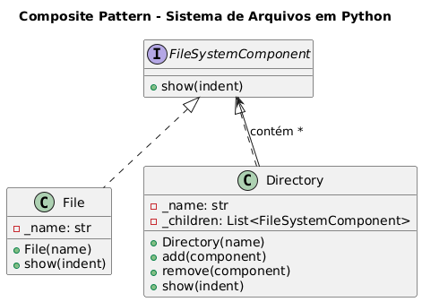

# Padrão Composite - Sistema de Arquivos

Este projeto demonstra a implementação do **Padrão Composite** em Python através de um sistema de arquivos simplificado.

## 📁 Sobre o Padrão Composite

O Padrão Composite permite tratar objetos individuais e composições de objetos de maneira uniforme. É especialmente útil quando você precisa trabalhar com estruturas hierárquicas em árvore.

## Cenário
Vamos modelar um sistema de arquivos onde Arquivos e Pastas devem ser manipulados de maneira uniforme.
Os dois implementam a interface ***FileSystemComponent***.

## 🏗️ Estrutura do Código

### Componentes Principais

- **`FileSystemComponent`** (ABC): Interface comum que define operações para arquivos e pastas
- **`File`** (Leaf): Representa arquivos simples sem filhos
- **`Directory`** (Composite): Representa pastas que podem conter outros componentes

### Funcionalidades

- ✅ Criação de arquivos e diretórios
- ✅ Adição/remoção de componentes em diretórios
- ✅ Exibição hierárquica da estrutura de pastas
- ✅ Tratamento uniforme de arquivos e pastas

## ⌨️ Código
```python
from abc import ABC, abstractmethod


# ---------------------------------------------------------
# Component (Interface comum para folhas e compósitos)
# ---------------------------------------------------------

class FileSystemComponent(ABC):
    """
    Interface que define operações comuns para arquivos e pastas.
    Este é o 'Component' do padrão Composite.
    """

    @abstractmethod
    def show(self, indent: int = 0) -> None:
        """
        Exibe o nome do componente com indentação.
        Útil para visualizar a hierarquia.
        """
        pass


# ---------------------------------------------------------
# Leaf (Objeto simples sem filhos)
# ---------------------------------------------------------

class File(FileSystemComponent):
    """
    Representa um arquivo simples.
    A operação show() é implementada diretamente, pois não possui filhos.
    """

    def __init__(self, name: str) -> None:
        self._name = name

    def show(self, indent: int = 0) -> None:
        """Exibe o arquivo com indentação apropriada."""
        print(" " * indent + f"- {self._name}")


# ---------------------------------------------------------
# Composite (Objeto que pode conter outros componentes)
# ---------------------------------------------------------

class Directory(FileSystemComponent):
    """
    Representa uma pasta que pode conter arquivos e outras pastas.
    Este é o 'Composite'.
    """

    def __init__(self, name: str) -> None:
        self._name = name
        self._children: list[FileSystemComponent] = []

    def add(self, component: FileSystemComponent) -> None:
        """Adiciona um componente filho ao diretório."""
        self._children.append(component)

    def remove(self, component: FileSystemComponent) -> None:
        """Remove um componente filho."""
        self._children.remove(component)

    def show(self, indent: int = 0) -> None:
        """Exibe o diretório e todos os seus filhos recursivamente."""
        print(" " * indent + f"[{self._name}]")
        for child in self._children:
            child.show(indent + 2)  # aumenta a indentação para filhos


# ---------------------------------------------------------
# Uso prático do padrão Composite
# ---------------------------------------------------------

# Criando arquivos
file_a = File("foto.png")
file_b = File("documento.pdf")
file_c = File("dados.csv")

# Criando pastas
root = Directory("root")
images = Directory("imagens")
docs = Directory("documentos")

# Construindo a hierarquia
images.add(file_a)
docs.add(file_b)
docs.add(file_c)

root.add(images)
root.add(docs)

# Exibindo a árvore de diretórios
root.show()

```

## 🚀 Como Executar

```bash
python exemplo_files_directores.py
```

## 📋 Exemplo de Saída

```
[root]
  [imagens]
    - foto.png
  [documentos]
    - documento.pdf
    - dados.csv
```

## 💡 Vantagens do Padrão

- **Simplicidade**: Trata objetos simples e compostos uniformemente
- **Flexibilidade**: Fácil adição de novos tipos de componentes
- **Recursividade**: Operações são aplicadas recursivamente na árvore
- **Manutenibilidade**: Código mais limpo e organizado

## 🎯 Casos de Uso

- Sistemas de arquivos
- Interfaces gráficas (widgets aninhados)
- Estruturas organizacionais
- Menus hierárquicos
- Árvores de expressões matemáticas