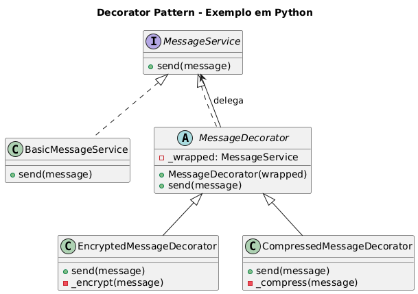

# Sistema de Mensagens com Criptografia e Compressão - Padrão Decorator

## Cenário

Vamos implementar um serviço de mensagens onde o objeto base envia texto simples.
Decoradores poderão adicionar funcionalidades, como:

- **Criptografia**
- **Compressão**

Cada decorador adiciona comportamento antes/depois da operação principal.

## Sobre o Padrão Decorator

O padrão Decorator permite adicionar novos comportamentos a objetos de forma dinâmica, sem alterar sua estrutura. É uma alternativa flexível à herança para estender funcionalidades.

## Estrutura do Código

### `MessageService` (Component)
Interface abstrata que define o contrato para envio de mensagens:
- `send(message)`: Método para enviar mensagens

### `BasicMessageService` (Concrete Component)
Implementação básica do serviço de mensagens:
- Envia mensagens sem processamento adicional

### `MessageDecorator` (Decorator Abstrato)
Classe base para todos os decoradores:
- Mantém referência ao componente original
- Delega chamadas para o objeto encapsulado

### Decoradores Concretos

#### `EncryptedMessageDecorator`
Adiciona criptografia às mensagens:
- Inverte o texto como exemplo de "pseudo-criptografia"
- Processa antes de delegar ao próximo componente

#### `CompressedMessageDecorator`
Adiciona compressão às mensagens:
- Remove espaços como exemplo de compressão simples
- Processa antes de delegar ao próximo componente

## Código

```python
from abc import ABC, abstractmethod


# ----------------------------------------------------------
# Component (Interface base)
# ----------------------------------------------------------

class MessageService(ABC):
    """
    Interface que define a operação de envio de mensagem.
    Representa o 'Component' no padrão Decorator.
    """

    @abstractmethod
    def send(self, message: str) -> None:
        pass


# ----------------------------------------------------------
# Concrete Component (Objeto original)
# ----------------------------------------------------------

class BasicMessageService(MessageService):
    """
    Implementação principal do serviço de mensagens.
    Envia o texto exatamente como foi recebido.
    """

    def send(self, message: str) -> None:
        print(f"Enviando mensagem: {message}")


# ----------------------------------------------------------
# Decorator Abstrato
# ----------------------------------------------------------

class MessageDecorator(MessageService):
    """
    Representa a estrutura base para todos os decoradores.
    Armazena um componente e delega chamadas para ele.
    """

    def __init__(self, wrapped: MessageService) -> None:
        self._wrapped = wrapped

    @abstractmethod
    def send(self, message: str) -> None:
        pass


# ----------------------------------------------------------
# Concrete Decorators (decoradores reais)
# ----------------------------------------------------------

class EncryptedMessageDecorator(MessageDecorator):
    """
    Adiciona criptografia antes de enviar a mensagem.
    """

    def send(self, message: str) -> None:
        encrypted = self._encrypt(message)
        self._wrapped.send(encrypted)

    def _encrypt(self, message: str) -> str:
        # Exemplo simples: inverte o texto como "pseudo-criptografia"
        return message[::-1]


class CompressedMessageDecorator(MessageDecorator):
    """
    Adiciona compressão simples antes de enviar a mensagem.
    """

    def send(self, message: str) -> None:
        compressed = self._compress(message)
        self._wrapped.send(compressed)

    def _compress(self, message: str) -> str:
        # Exemplo simplificado: remove espaços
        return message.replace(" ", "")


# ----------------------------------------------------------
# Uso prático do padrão Decorator
# ----------------------------------------------------------

# Serviço básico
service = BasicMessageService()

# Decorando com criptografia
encrypted_service = EncryptedMessageDecorator(service)

# Decorando com compressão e criptografia
compressed_then_encrypted = EncryptedMessageDecorator(
    CompressedMessageDecorator(service)
)

# Execução
service.send("Mensagem simples.")
encrypted_service.send("Mensagem confidencial.")
compressed_then_encrypted.send("Mensagem com compressão e criptografia.")

```

## Execução

```bash
python exemplo_cript_compress.py
```

**Saída esperada:**
```
Enviando mensagem: Mensagem simples.
Enviando mensagem: .laicnedifnoc megasneM
Enviando mensagem: .aifargotpirceeoãsserpmocomegasneM
```

## Vantagens do Decorator

- **Flexibilidade**: Combina funcionalidades dinamicamente
- **Responsabilidade única**: Cada decorator tem uma função específica
- **Extensibilidade**: Fácil adição de novos comportamentos
- **Composição**: Permite múltiplas combinações de funcionalidades

## Casos de Uso Práticos

- Sistemas de logging com diferentes níveis
- Processamento de dados com múltiplas transformações
- APIs com autenticação, cache e validação
- Interfaces gráficas com bordas, sombras e efeitos