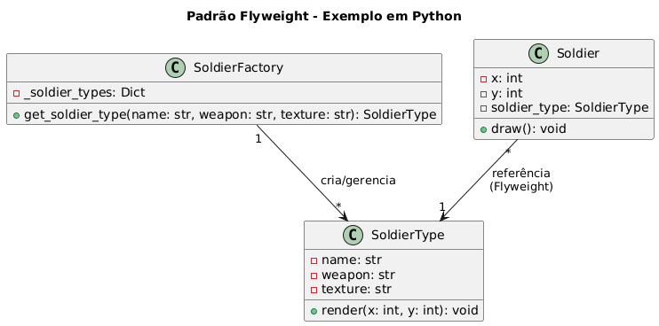

# Sistema de Soldados em Jogo - Padrão Flyweight

## Contexto do exemplo:
Vamos simular um jogo onde múltimos “soldados” são criados. Os atributos que mudam entre soldados são chamados de **estado extrínseco** (posição, vida, etc.).
Os atributos compartilhados, imutáveis e pesados na memória formam o **estado intrínseco** (modelo 3D, texturas, sons).

Assim, milhares de soldados podem reutilizar o mesmo objeto Flyweight, economizando memória.

## Sobre o Padrão Flyweight

O padrão Flyweight é usado para minimizar o uso de memória quando se trabalha com um grande número de objetos similares. Ele separa o estado em duas partes: **intrínseco** (compartilhado) e **extrínseco** (único por objeto).

## Estrutura do Sistema

### `SoldierType` (Flyweight)
Armazena o **estado intrínseco** compartilhado entre soldados:
- `name`: Nome da classe do soldado (ex: "Infantaria")
- `weapon`: Arma padrão do tipo
- `texture`: Arquivo de textura (dados pesados compartilhados)
- `render(x, y)`: Renderiza o soldado recebendo coordenadas como parâmetro

### `SoldierFactory` (Flyweight Factory)
Gerencia a criação e reutilização dos Flyweights:
- `get_soldier_type()`: Retorna um tipo existente ou cria um novo
- `_soldier_types`: Dicionário que armazena os tipos criados

### `Soldier` (Context)
Contém o **estado extrínseco** único de cada soldado:
- `x, y`: Posição específica do soldado
- `soldier_type`: Referência ao Flyweight compartilhado
- `draw()`: Desenha o soldado usando o tipo compartilhado

## Estados Intrínseco vs Extrínseco

### Estado Intrínseco (Compartilhado)
- Nome da classe do soldado
- Tipo de arma
- Texturas e modelos 3D
- Animações e sons

### Estado Extrínseco (Único)
- Posição (x, y)
- Pontos de vida
- Velocidade atual
- Status específico

## Código

```python
"""
Exemplo do padrão Flyweight aplicado a um jogo com múltiplos soldados.
Comentários seguem boas práticas de Clean Code:
- Nomes claros e autoexplicativos
- Funções pequenas e com responsabilidades bem definidas
- Comentários apenas onde agregam contexto
"""

from typing import Dict


class SoldierType:
    """
    O Flyweight (estado intrínseco).
    Armazena dados pesados e imutáveis compartilhados por muitos objetos.
    Ex.: modelo 3D, texturas, sons, animações.
    """

    def __init__(self, name: str, weapon: str, texture: str):
        self.name = name              # Nome da classe do soldado (ex: "Infantaria")
        self.weapon = weapon          # Arma padrão
        self.texture = texture        # Arquivo de textura (grande e compartilhado)

    def render(self, x: int, y: int) -> None:
        """
        Simula o desenho do soldado na posição X,Y.
        Recebe estado extrínseco (coordenadas), pois não deve armazená-lo.
        """
        print(
            f"[Renderizando] {self.name} com arma {self.weapon} "
            f"usando textura '{self.texture}' na posição ({x}, {y})"
        )


class SoldierFactory:
    """
    Flyweight Factory.
    Cria e gerencia instâncias de SoldierType, garantindo reutilização.
    """

    _soldier_types: Dict[str, SoldierType] = {}

    @classmethod
    def get_soldier_type(cls, name: str, weapon: str, texture: str) -> SoldierType:
        """
        Retorna um Flyweight existente ou cria um novo.
        A chave é construída com os atributos intrínsecos.
        """
        key = f"{name}_{weapon}_{texture}"

        # Reuso: se já existe, retorna o existente
        if key not in cls._soldier_types:
            cls._soldier_types[key] = SoldierType(name, weapon, texture)

        return cls._soldier_types[key]


class Soldier:
    """
    Objeto que contém **estado extrínseco** (não compartilhado):
    posição, vida, velocidade etc.
    Mantém uma referência ao Flyweight (estado intrínseco).
    """

    def __init__(self, x: int, y: int, soldier_type: SoldierType):
        self.x = x
        self.y = y
        self.soldier_type = soldier_type

    def draw(self) -> None:
        """
        Desenha o soldado. Apenas repassa o estado extrínseco.
        """
        self.soldier_type.render(self.x, self.y)


# ------------------ Exemplo de Uso ------------------

if __name__ == "__main__":
    # Criando tipos compartilhados (Flyweights)
    infantry_type = SoldierFactory.get_soldier_type(
        "Infantaria", "Rifle", "infantry_texture.png"
    )
    sniper_type = SoldierFactory.get_soldier_type(
        "Sniper", "Sniper Rifle", "sniper_texture.png"
    )

    # Criando soldados com estado extrínseco único
    soldiers = [
        Soldier(10, 20, infantry_type),
        Soldier(15, 25, infantry_type),
        Soldier(20, 30, sniper_type),
    ]

    # Desenhando soldados
    for s in soldiers:
        s.draw()

```

## Execução

```bash
python exemplo_flyweight.py
```

**Saída esperada:**
```
[Renderizando] Infantaria com arma Rifle usando textura 'infantry_texture.png' na posição (10, 20)
[Renderizando] Infantaria com arma Rifle usando textura 'infantry_texture.png' na posição (15, 25)
[Renderizando] Sniper com arma Sniper Rifle usando textura 'sniper_texture.png' na posição (20, 30)
```

## Vantagens do Flyweight

- **Economia de memória**: Compartilha dados pesados entre objetos
- **Performance**: Reduz overhead de criação de objetos
- **Escalabilidade**: Permite milhares de objetos similares
- **Organização**: Separa claramente estado compartilhado do único

## Economia de Memória

### Sem Flyweight
- 1000 soldados = 1000 cópias de texturas e modelos
- Uso excessivo de memória

### Com Flyweight
- 1000 soldados = poucos tipos compartilhados + 1000 posições
- Economia significativa de memória

## Casos de Uso Práticos

- **Jogos**: Personagens, projéteis, partículas
- **Editores de texto**: Caracteres com formatação
- **Sistemas gráficos**: Ícones e símbolos repetidos
- **Simulações**: Objetos com propriedades similares

## Considerações Importantes

- Use quando há muitos objetos similares
- Estado intrínseco deve ser imutável
- Estado extrínseco é passado como parâmetro
- Factory garante reutilização adequada